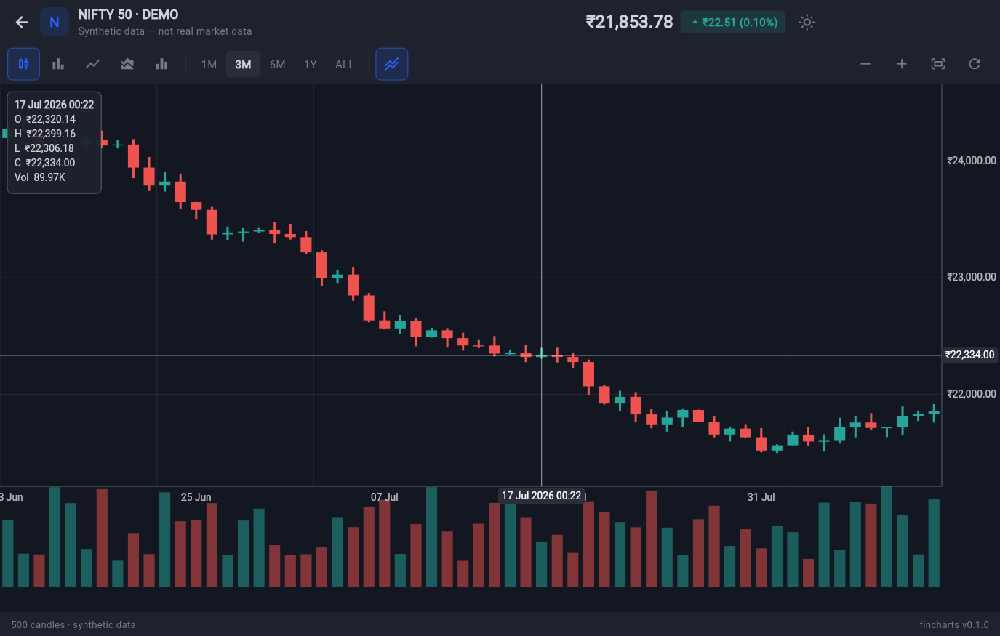
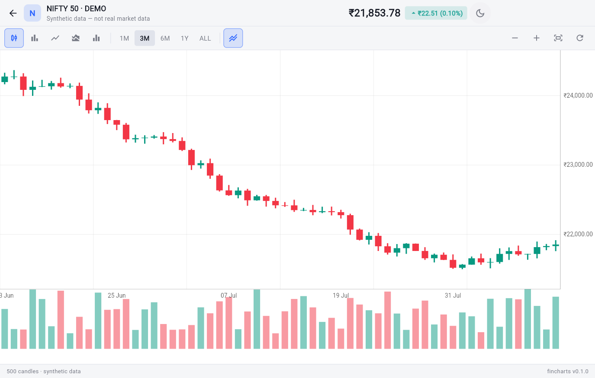

# FinCharts

A Flutter-native financial charting engine for fintech, trading, and investment applications.

`fincharts` renders candlestick, OHLC, line, area, and volume charts entirely with `CustomPainter` — no per-candle widgets, no external chart-library dependency, no assumptions about where your data comes from. It's built to be a lightweight, Flutter-native foundation that broker, fintech, and portfolio apps can build on, not a demo.

<p align="center">
  
</p>

<p align="center"><sub>The example app's Chart demo page — see <a href="example/">example/</a>.</sub></p>

## Features

- **Five chart types**: candlestick, OHLC, line, area, volume
- **Pan and zoom** — touch drag/pinch, and mouse-wheel/trackpad scroll on desktop and web — with focal-point-preserving zoom and clamped bounds
- **Live data ready** — frequent `data` updates (tick updates, new bars) are handled efficiently, with the viewport and an active crosshair preserved across updates, plus an optional live price line
- **Crosshair and OHLCV tooltip**, working identically across every chart type
- **Dynamic price and time axes** with adaptive precision and overlap-free labels
- **Dark and light themes**, fully composable — no hard-coded colors in any renderer
- **A programmatic controller** (`zoomIn`, `zoomOut`, `fitContent`, `scrollToLatest`, `resetViewport`)
- **Renders only what's visible** — a 100,000-candle data set costs the same per frame as a 200-candle one
- **Backend- and broker-agnostic** — the package accepts `Candle` data; it has no idea where it came from
- **Framework-friendly** — works inside `Column`, `Expanded`, `SizedBox`, `Sliver`, `Dialog`, `BottomSheet`, etc.
- **No forced state management** — plain `ChangeNotifier`, works with Bloc, Riverpod, Provider, GetX, or `setState`


## Installation

```yaml
dependencies:
  fincharts: ^0.1.0
```

```bash
flutter pub get
```

## Quick start

```dart
import 'package:fincharts/fincharts.dart';

FinancialChart(
  data: candles, // List<Candle>
  type: FinancialChartType.candlestick,
)
```

`FinancialChart` expects bounded layout constraints from its parent (like any `CustomPaint`-based widget) — wrap it in `Expanded`, `SizedBox`, or similar if its parent would otherwise offer unbounded space.

### The `Candle` model

```dart
final candle = Candle(
  timestamp: DateTime.utc(2026, 8, 8, 9, 15),
  open: 24820.50,
  high: 24865.20,
  low: 24801.10,
  close: 24852.40,
  volume: 1240000,
);
```

`Candle` validates its own invariants (finite values, non-negative volume, a consistent high/low) via `assert()` in debug builds only — see [Data validation](#data-validation) for how `FinancialChart` protects itself in release builds against real-world malformed data.

## Candlestick example

```dart
FinancialChart(
  data: candles,
  type: FinancialChartType.candlestick,
)
```

## OHLC example

```dart
FinancialChart(
  data: candles,
  type: FinancialChartType.ohlc,
)
```

## Line example

```dart
FinancialChart(
  data: candles,
  type: FinancialChartType.line,
  config: FinancialChartConfig(priceField: PriceField.close),
)
```

## Area example

```dart
FinancialChart(
  data: candles,
  type: FinancialChartType.area,
)
```

## Volume example

```dart
FinancialChart(
  data: candles,
  type: FinancialChartType.volume,
)
```

Volume can also be composited as a sub-pane beneath any other chart type:

```dart
FinancialChart(
  data: candles,
  type: FinancialChartType.candlestick,
  config: FinancialChartConfig(showVolumePane: true),
)
```

## Live data

`fincharts` doesn't fetch or stream data itself — the package accepts `Candle` data and knows nothing about where it came from — but it's built to be fed a `data` list that changes frequently, whether from a `Timer`, a `WebSocket`/`Stream`, or your own state management:

```dart
FinancialChart(
  data: candles, // a new List<Candle> each time you receive an update
  controller: controller,
  config: FinancialChartConfig(showLivePriceLine: true),
)
```

There are two update shapes a live feed produces, and both are handled correctly:

- **A tick on the currently-forming candle** — same `data.length`, only the last candle's OHLCV changed. The viewport doesn't move, and the price axis/live price line update in place.
- **A new candle appended when a bar closes** — `data.length` grows by one. If the user was scrolled to the latest candle, the viewport shifts to keep the new candle in view; if they'd scrolled back into history, their position is left alone rather than being yanked back to "now".

Either way, **replace `data` with a new `List<Candle>` — don't mutate an existing list in place.** `FinancialChart` diffs by list identity to decide whether to re-normalize, so an in-place mutation won't be picked up:

```dart
// Good: a new list, so FinancialChart notices the update.
setState(() => candles = [...candles.sublist(0, candles.length - 1), updatedLastCandle]);

// Bad: mutating the existing list means FinancialChart won't see any change.
candles[candles.length - 1] = updatedLastCandle;
setState(() {});
```

An active crosshair also survives a live update — hovering the ticking candle shows its tooltip updating in real time instead of freezing or disappearing on every tick, since the crosshair re-resolves against the same candle index rather than holding a stale snapshot.

Set `config.showLivePriceLine: true` for the classic "this is live" affordance: a dashed line and price tag at the latest close, colored to match its direction, that stays visible even while scrolled back into history.

## Controller

```dart
final controller = FinancialChartController();

FinancialChart(
  data: candles,
  controller: controller,
)

controller.zoomIn();
controller.zoomOut();
controller.fitContent();
controller.scrollToLatest();
controller.resetViewport();
```

`FinancialChartController` is a plain `ChangeNotifier` — attach it to a `FinancialChart`, drive it from buttons, keyboard shortcuts, or your own state management, and it stays in sync with the chart's data length automatically.

### Pan & zoom input

`config.enablePan`/`config.enableZoom` gate two independent input paths, both feeding the same viewport math:

- **Touch**: drag to pan, pinch to zoom, via Flutter's own multi-touch scale gesture.
- **Mouse/trackpad (desktop & web)**: click-drag to pan; mouse-wheel or trackpad scroll to zoom, centered on the pointer. This is the primary zoom path on desktop — a trackpad "pinch" is delivered to the browser as wheel events rather than multi-touch pointer events, and that translation is inconsistent enough across browsers/platforms (notably Windows Chrome) that relying on it alone isn't reliable, so wheel/scroll is handled directly instead.

## Theming

```dart
FinancialChart(
  data: candles,
  theme: FinancialChartThemeData.dark(), // or .light(), or .fromBrightness(...)
)
```

<p align="center">
  
</p>

Every visual value — background, grid, candle/wick colors, volume colors, axis text, crosshair, tooltip, line and area styling — comes from `FinancialChartThemeData`. No renderer hard-codes a color. Build a fully custom theme, or start from `.dark()`/`.light()` and override individual pieces with `copyWith`:

```dart
final theme = FinancialChartThemeData.dark().copyWith(
  candle: const CandleStyle(
    bullishColor: Color(0xFF00C853),
    bearishColor: Color(0xFFD50000),
    dojiColor: Color(0xFF9E9E9E),
    bullishWickColor: Color(0xFF00C853),
    bearishWickColor: Color(0xFFD50000),
  ),
);
```

## Crosshair

```dart
FinancialChart(
  data: candles,
  config: FinancialChartConfig(
    crosshair: CrosshairConfig(
      enabled: true,
      showVerticalLine: true,
      showHorizontalLine: true,
    ),
  ),
)
```

The crosshair responds to long-press-drag (touch) and pointer hover (desktop/web), snaps to the nearest candle, and shows a full OHLCV tooltip — identically across all five chart types, since crosshair rendering has no dependency on which chart type is active.

## Data validation

`Candle` only validates via `assert()` (zero-cost in release builds). `FinancialChart` is what actually protects a running app from malformed data: whenever `data`'s identity changes, it normalizes the list once —

- drops candles with a non-finite (NaN/Infinity) value,
- clamps negative volume to zero,
- sorts the list if it isn't already sorted by timestamp,
- deduplicates repeated timestamps (keeping the later entry).

Pass `onDataIssues` to be notified (as a list of human-readable strings) whenever a correction was applied — most apps supplying well-formed data will never see it called.

## Performance considerations

- Only the candles inside the current viewport are ever handed to a renderer — painting cost is proportional to what's on screen, not to the size of `data`.
- No widget is created per candle, per bar, or per volume tick — every chart type is drawn with `Canvas`/`Path`/`Paint` inside a single `CustomPainter`.
- The example app's **Performance** page lets you switch between 1,000 / 10,000 / 50,000-candle data sets to manually assess pan/zoom smoothness; run it in profile mode with Flutter's performance overlay for objective frame timing. We don't make specific numeric performance claims here — measure it in the environment that matters to you.

## Architecture

```
FinancialChart (widget)
  -> FinancialChartController (viewport, exposed API)
  -> normalizeCandleData (validate-and-sanitize data boundary)
  -> ChartViewport (visible index window) + ChartCoordinateSystem (data <-> pixel space)
  -> FinancialChartPainter (CustomPainter, fixed pipeline)
       background -> grid -> main ChartRenderer -> volume pane -> crosshair -> price axis -> time axis
```

- `**ChartRenderer**` is an interface, not a `switch` — candlestick, OHLC, line, area, and volume are each their own implementation, resolved from `FinancialChartType` via a lookup table. Adding a chart type in a future release means adding a renderer and a map entry, not editing existing ones.
- `**ChartViewport**` is a fractional-index window (`startIndex`/`endIndex`), not a pixel offset — this keeps pan/zoom math resolution-independent and testable without a widget tree. Pan and zoom themselves are pure functions in `pan_handler.dart`/`zoom_handler.dart`.
- `**ChartCoordinateSystem**` is the single place price/index/timestamp ↔ pixel conversions happen. No renderer computes a coordinate any other way.
- The package has **zero non-Flutter dependencies** and never imports networking, storage, or broker SDKs — it accepts `Candle` data and renders it, full stop.

## Roadmap

- **0.1.0** — candlestick, OHLC, line, area, volume; pan/zoom/crosshair/tooltip; theming; controller
- **0.2.0** (this release) — mouse-wheel/trackpad zoom; live-data support (efficient streaming updates, viewport/crosshair preserved across ticks, live price line)
- **0.3.0+** — SMA, EMA, RSI, MACD, Bollinger Bands, Fibonacci tools, drawing tools, Renko, Heikin Ashi, multi-pane indicators

Breaking changes will be deliberate, documented in [CHANGELOG.md](CHANGELOG.md), and versioned accordingly.

## Contributing

Issues and PRs are welcome. Before opening a PR, please make sure:

```bash
dart format .
flutter analyze
flutter test
```

all pass cleanly, and that any new public API has DartDoc.

## License

MIT — see [LICENSE](LICENSE).